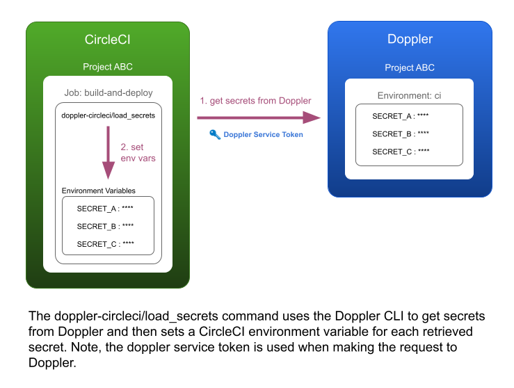

# Doppler CircleCI Orb

[](https://circleci.com/gh/ft-circleci-orbs/doppler-circleci-orb) [](https://raw.githubusercontent.com/ft-circleci-orbs/doppler-circleci-orb/master/LICENSE)

A CircleCI orb to load secrets managed in Doppler into CircleCI projects as environment variables.

---

## Prerequisite Steps

### 1. Create a project in Doppler

Guidance on how to create a **Project** can be found [here](https://docs.doppler.com/docs/create-project#create-a-project).

### 2. Configure secrets to be used in CircleCI

Add secrets to the **ci** environment within the Doppler project for all secrets you want to access in CircleCI.

### 3. Create a Doppler Service Token for use in CircleCI

Within the Doppler project **ci** environment, select Access and then Generate Service Token.  Give your Doppler Service Token a nice descriptive name e.g. {YourCircleCIProjectName}-CircleCI-Token. Stash the generated token as you will need it in the next step.

Guidance on how to create a **Doppler Service Token** can be found [here](https://docs.doppler.com/docs/service-tokens#creating-service-tokens).

---

## CircleCI Usage

### 1. Configure DOPPLER_TOKEN environment variable

Within CircleCI, configure a new project environment variable named DOPPLER_TOKEN, with the value being the Doppler Service Token stashed previously.

Guidance on how to set up a project environment variable in CircleCI can be found [here](https://circleci.com/docs/set-environment-variable/#set-an-environment-variable-in-a-project).

### 2. Configure the Doppler CircleCI Orb

Add the following to your CircleCI project config file (.circleci/config.yml) to make the doppler-circleci orb available to use:

```yml
orbs:
    doppler-circleci: ft-circleci-orbs/doppler-circleci@1.2
```

### 3. Install Doppler CLI and load secrets

Within a job configuration use the doppler-circleci commands ```install``` and ```load_secrets``` as follows:

```yml
jobs:
  retrieve-secret-from-doppler-with-orb:
    docker:
      - image: cimg/base:current
    steps:
      - checkout
      - doppler-circleci/install
      - doppler-circleci/load_secrets
      - run:
          name: Echo a Doppler secret after loading secrets
          command: echo -e "${YOUR_DOPPLER_SECRET}"
```

Secrets defined in the Doppler project **ci** environment will get configued as environment variables if everything is set up correctly. After load_secrets is executed, secrets will be accesible using the [CircleCI environment variables syntax](https://circleci.com/docs/env-vars/) e.g. ```${YOUR_DOPPLER_SECRET}```.

If you're using an Alpine based Docker image, when loading secrets an extra step is required:

```yml
      - run:
          name: Echo a Doppler secret after loading secrets
          command: source $BASH_ENV && echo -e "${YOUR_DOPPLER_SECRET}"
```

---

## Orb Commands

#### `doppler-circleci/install`

Installs the latest version of the doppler CLI. Supports linux (apt-get) and macos (brew) package installers.

#### `doppler-circleci/load_secrets`

Loads any doppler secrets from the Doppler project ci environment into environment variables within the CircleCI job.

When using a Doppler service token there is no need to specify a project, since the token is linked to a project already.



---

## Additional Resources

There is a Financial Times internal [guide on Tech Hub](https://tech.in.ft.com/tech-topics/secrets-management/doppler/guide) which will walk you through how to get the best out of Doppler.

Please also refer to the Financial Times internal Cyber Security teams guidelines for more information on [default Doppler environments](https://tech.in.ft.com/tech-topics/secrets-management/doppler/guide#using-the-default-environments).

## Acknowledgements

This orb is based on [conpagoaus/doppler-orb](https://github.com/conpagoaus/doppler-orb) and adapted for the Financial Times.
